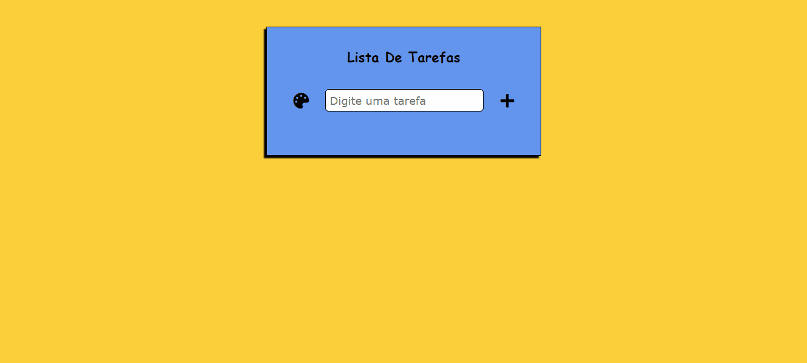

# Lista De Tarefas

### Esse projeto foi a criação de uma lista de tarefas!

- Foi usado o localStorage para armazenar as tarefas informada pelo o usuário, para que mesmo que ele feche a tela e quando voltar ainda esteja lá a determinada tarefa informada por ele!

### Loyout para notebook e desktop

🚀Tecnologias usadas:
- ✔HTML
- ✔CSS
- ✔JAVASCRIPT

